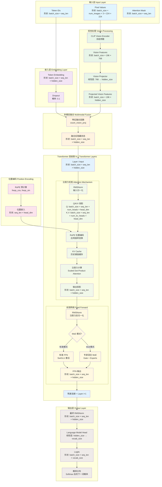
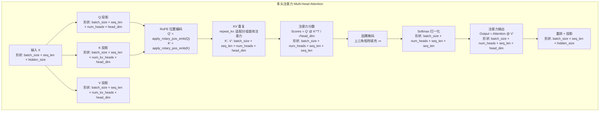
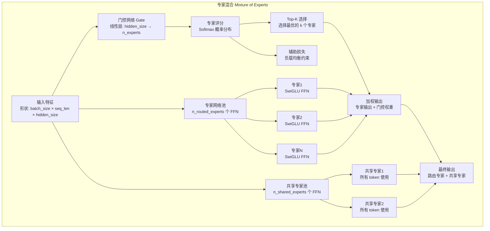
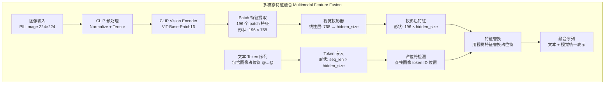

# Zero2LLMV 语言模型架构解析

## 模型概览

Zero2LLMV 是一个基于 Transformer 的多模态大语言模型，支持文本生成和视觉语言理解。模型采用解码器架构，具备以下核心特性：

- **基础模型**: CausalLM (因果语言模型)
- **视觉扩展**: VLM (视觉语言模型) 
- **高级特性**: MoE (专家混合)、GQA (分组查询注意力)、RoPE (旋转位置编码)

## 整体架构流程图



## 关键组件详细分析

### 1. 注意力机制详解



### 2. MoE 专家混合架构



### 3. 视觉语言融合流程



## 张量形状变换总览

| 阶段 | 输入形状 | 输出形状 | 关键操作 |
|------|----------|----------|----------|
| Token Embedding | `[B, L]` | `[B, L, H]` | 词嵌入查找 |
| Vision Encoding | `[B, 3, 224, 224]` | `[B, 196, 768]` | CLIP ViT 编码 |
| Vision Projection | `[B, 196, 768]` | `[B, 196, H]` | 线性变换 |
| Q/K/V Projection | `[B, L, H]` | `[B, L, N_h, D_h]` | 多头分割 |
| Attention Scores | `[B, N_h, L, D_h]` | `[B, N_h, L, L]` | Q@K^T / √D_h |
| FFN Gate | `[B, L, H]` | `[B, L, I]` | 线性投影 |
| FFN Up/Down | `[B, L, H]` | `[B, L, H]` | SwiGLU 变换 |
| LM Head | `[B, L, H]` | `[B, L, V]` | 词汇表投影 |

**符号说明:**
- B: batch_size
- L: seq_len (序列长度)
- H: hidden_size (隐藏层维度)
- N_h: num_heads (注意力头数)
- D_h: head_dim (每头维度)
- I: intermediate_size (FFN中间维度)
- V: vocab_size (词汇表大小)

## 模型参数量估算

### 基础 LLM 参数量

```mermaid
graph LR
    subgraph "参数分布 Parameter Distribution"
        A[Token Embedding<br/>V × H]
        B[Position Encoding<br/>预计算，无参数]
        C[N × Transformer Layers]
        D[Attention Weights<br/>4 × H × H 每层]
        E[FFN Weights<br/>3 × H × I 每层]
        F[LayerNorm<br/>2 × H 每层]
        G[LM Head<br/>共享 Embedding 权重]
    end
    
    H[总参数量<br/>≈ V×H + N×(4×H² + 3×H×I + 2×H)]
```

### 关键超参数配置

| 参数名称 | 默认值 | 影响 |
|----------|--------|------|
| `hidden_size` | 768 | 模型表达能力，影响所有层的参数量 |
| `num_hidden_layers` | 12 | 模型深度，影响总参数量和计算复杂度 |
| `num_attention_heads` | 12 | 注意力机制的并行度 |
| `num_key_value_heads` | 4 | GQA 中的 KV 头数，减少 KV Cache 内存 |
| `intermediate_size` | 3072 | FFN 中间层大小，影响前馈网络容量 |
| `vocab_size` | 30000 | 词汇表大小，影响嵌入层参数量 |
| `max_position_embeddings` | 2048 | 最大序列长度 |

### MoE 扩展参数

| 参数名称 | 默认值 | 说明 |
|----------|--------|------|
| `use_moe` | False | 是否启用专家混合 |
| `n_routed_experts` | 8 | 可路由专家数量 |
| `n_shared_experts` | 2 | 共享专家数量 |
| `num_experts_per_token` | 2 | 每个 token 激活的专家数 |
| `aux_loss_alpha` | 0.01 | 辅助损失权重 |

## 实现特色

1. **内存优化**: 
   - KV Cache 缓存机制
   - 分组查询注意力 (GQA)
   - 可选的 Flash Attention

2. **多模态融合**:
   - CLIP 视觉编码器
   - 灵活的特征投影机制
   - 统一的序列建模

3. **可扩展架构**:
   - 模块化的专家混合
   - 可配置的模型规模
   - 标准的 HuggingFace 接口

4. **训练稳定性**:
   - RMSNorm 归一化
   - 梯度裁剪
   - 权重共享策略