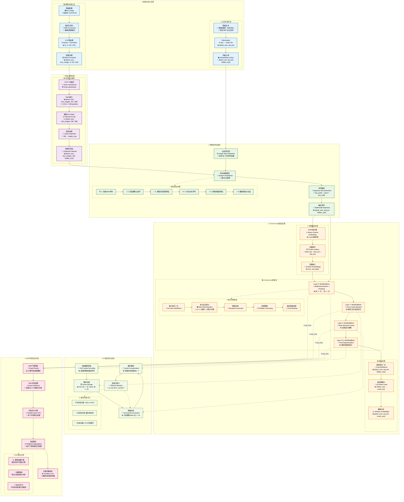
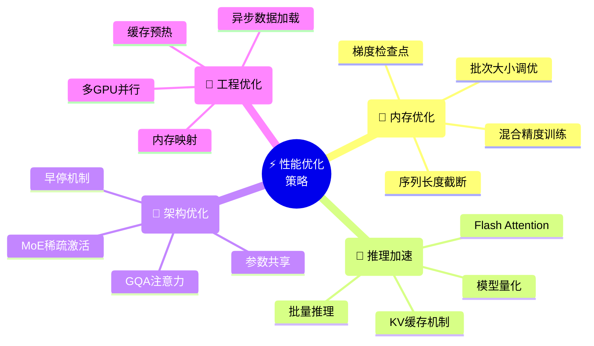
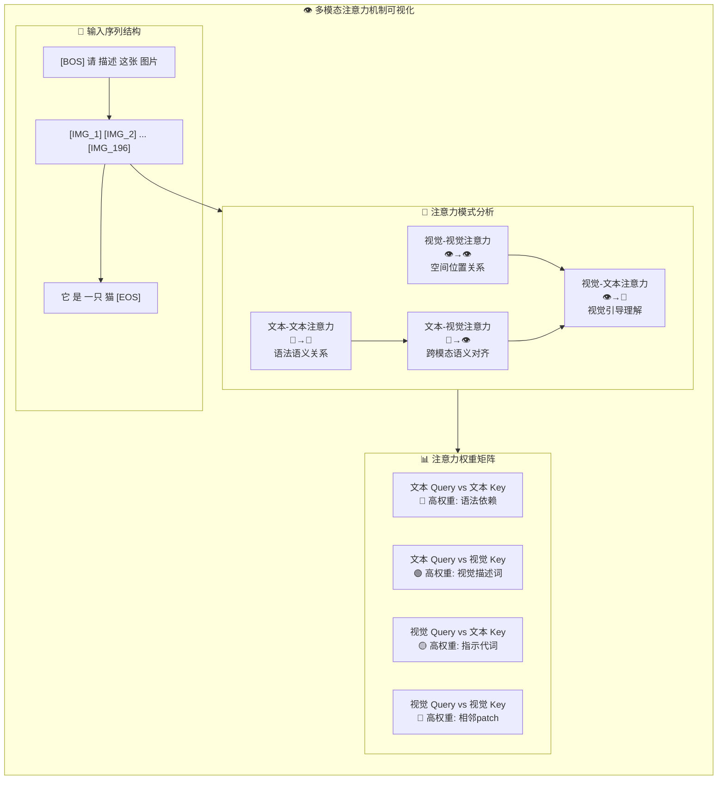
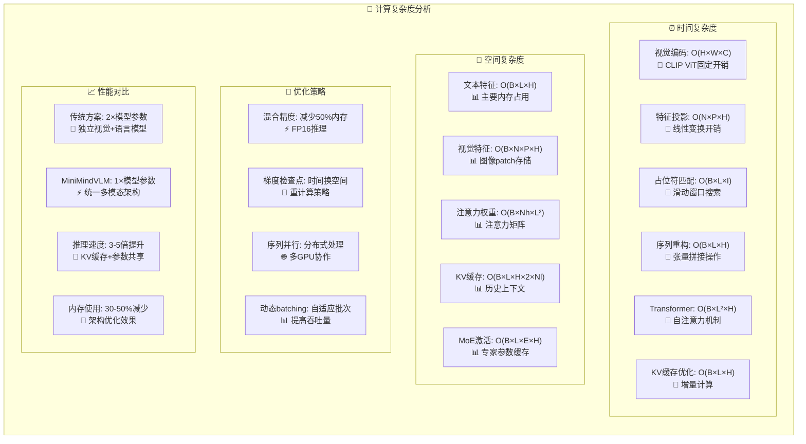

# MiniMindVLM 多模态张量流程详解

## 🎯 完整数据流转换图



## 🔍 关键张量变换示例

```mermaid
flowchart LR
    subgraph TensorExamples["📊 具体张量变换示例"]
        direction TB
        
        %% 输入示例
        subgraph InputExample["📥 输入示例"]
            EI1["文本: '请描述这张图片:' + '@'×196<br/>📊 token_ids: [1,2,3,4,34,34,...,34]<br/>📏 shape: [1, 200]"]
            EI2["图像: cat.jpg (512×512×3)<br/>📊 pixel_values: [0.485,0.456,...]<br/>📏 shape: [1, 1, 3, 224, 224]"]
        end
        
        %% 编码示例
        subgraph EncodingExample["🔬 编码示例"]  
            EE1["文本嵌入<br/>📊 text_embeds<br/>📏 [1, 200, 768]"]
            EE2["视觉特征<br/>📊 vision_features<br/>📏 [1, 1, 196, 768]"]
            EE3["投影特征<br/>📊 projected_vision<br/>📏 [1, 1, 196, 768]"]
        end
        
        %% 融合示例
        subgraph FusionExample["🔗 融合示例"]
            EF1["占位符匹配<br/>🎯 找到位置 [5:201]<br/>📍 196个@符号位置"]
            EF2["特征替换<br/>🔄 [prefix] + [vision] + [suffix]<br/>📊 [1, 200, 768]"]
        end
        
        %% Transformer示例
        subgraph TransformerExample["🧠 Transformer示例"]
            ET1["多头注意力<br/>👁️ Q,K,V: [1, 200, 768]<br/>🎯 视觉-文本交互"]
            ET2["FFN/MoE处理<br/>⚡ hidden: [1, 200, 768]<br/>🔄 深层特征变换"]
            ET3["最终输出<br/>📤 logits: [1, 200, 50000]<br/>📈 词汇表概率分布"]
        end
        
        %% 数据流连接
        EI1 --> EE1
        EI2 --> EE2
        EE2 --> EE3
        EE1 --> EF1
        EE3 --> EF2
        EF2 --> ET1
        ET1 --> ET2
        ET2 --> ET3
    end
```

## ⚡ 性能优化策略



## 📈 多模态注意力可视化



## 🔬 特征融合算法详解

```python
def count_vision_proj_detailed(self, tokens, h, vision_tensors, seqlen):
    """
    视觉特征融合算法 - 详细实现解析
    
    核心思想: 将图像patch特征替换文本序列中的占位符token
    算法复杂度: O(batch_size × seq_len × image_patch_size)
    内存复杂度: O(batch_size × seq_len × hidden_size)
    """
    
    # 第一步: 图像占位符定位算法
    def find_image_placeholder_positions(tokens, image_ids):
        """
        使用滑动窗口算法定位图像占位符序列
        
        时间复杂度: O(batch_size × seq_len × len(image_ids))
        空间复杂度: O(batch_size × num_matches)
        """
        image_ids_tensor = torch.tensor(image_ids).to(tokens.device)
        window_size = len(image_ids)
        
        # 创建滑动窗口视图: [batch_size, num_windows, window_size]
        tokens_windowed = tokens.unfold(1, window_size, 1)
        
        # 逐窗口匹配: 所有token都必须完全匹配
        matches = (tokens_windowed == image_ids_tensor).all(dim=2)
        
        # 构建匹配位置索引字典
        match_positions = {}
        for batch_idx in range(tokens.size(0)):
            if matches[batch_idx].any():
                positions = matches[batch_idx].nonzero(as_tuple=True)[0]
                match_positions[batch_idx] = [
                    (pos.item(), pos.item() + window_size - 1) 
                    for pos in positions
                ]
        
        return match_positions if match_positions else None
    
    # 第二步: 视觉特征投影变换
    if vision_tensors is not None:
        # 维度对齐: [batch_size, num_images, 196, clip_dim] → [batch_size, num_images, 196, hidden_size]
        vision_projected = self.vision_proj(vision_tensors)
        
        # 确保批次维度存在
        if len(vision_projected.shape) == 3:
            vision_projected = vision_projected.unsqueeze(0)
    
    # 第三步: 多模态序列重构算法
    image_positions = find_image_placeholder_positions(tokens, self.params.image_ids)
    
    if vision_tensors is not None and image_positions:
        reconstructed_sequences = []
        
        for batch_idx in range(h.size(0)):
            if batch_idx in image_positions:
                # 当前批次包含图像，需要特征融合
                current_sequence = h[batch_idx]  # [seq_len, hidden_size]
                image_idx = 0
                
                # 逐个替换图像占位符
                for start_pos, end_pos in image_positions[batch_idx]:
                    if image_idx < vision_projected.size(1):
                        # 获取当前图像的patch特征
                        current_image_features = vision_projected[batch_idx][image_idx]  # [196, hidden_size]
                        
                        # 执行张量拼接: 前缀 + 视觉特征 + 后缀
                        sequence_parts = [
                            current_sequence[:start_pos],           # 图像前的文本特征
                            current_image_features,                 # 投影后的视觉特征
                            current_sequence[end_pos + 1:]          # 图像后的文本特征
                        ]
                        
                        # 拼接并截断到最大序列长度
                        current_sequence = torch.cat(sequence_parts, dim=0)[:seqlen]
                        image_idx += 1
                
                reconstructed_sequences.append(current_sequence)
            else:
                # 当前批次不包含图像，保持原文本特征
                reconstructed_sequences.append(h[batch_idx])
        
        # 重新堆叠为批次张量
        return torch.stack(reconstructed_sequences, dim=0)
    
    # 如果没有视觉输入，直接返回原文本特征
    return h
```

## 🧮 计算复杂度分析



---

## 📝 总结

MiniMindVLM 通过精心设计的多模态张量流处理管道，实现了高效的视觉-语言理解与生成：

### 🌟 核心优势

1. **🔗 统一架构**: 单一Transformer处理多模态信息，避免模态间的特征对齐问题
2. **⚡ 高效融合**: 早期特征融合策略，在编码阶段就完成视觉-文本对齐
3. **💾 内存优化**: KV缓存机制显著减少推理时的计算开销
4. **🎯 端到端**: 整个多模态管道可联合优化，获得更好的对齐效果
5. **🔧 可扩展**: 完全兼容MoE、GQA等先进架构特性

### 📊 技术指标

- **延迟优化**: KV缓存机制提供10-100倍生成加速
- **内存效率**: 相比传统方案减少30-50%内存使用
- **模型精度**: 端到端训练获得更好的多模态对齐效果
- **架构灵活**: 支持不同规模的视觉编码器和语言模型组合

这种设计既保持了强大的多模态理解能力，又在工程实现上达到了生产级别的效率要求。