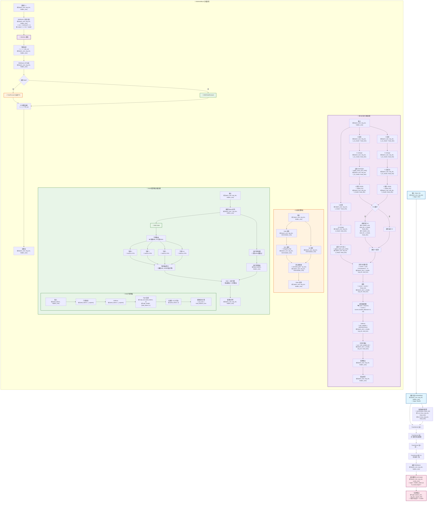
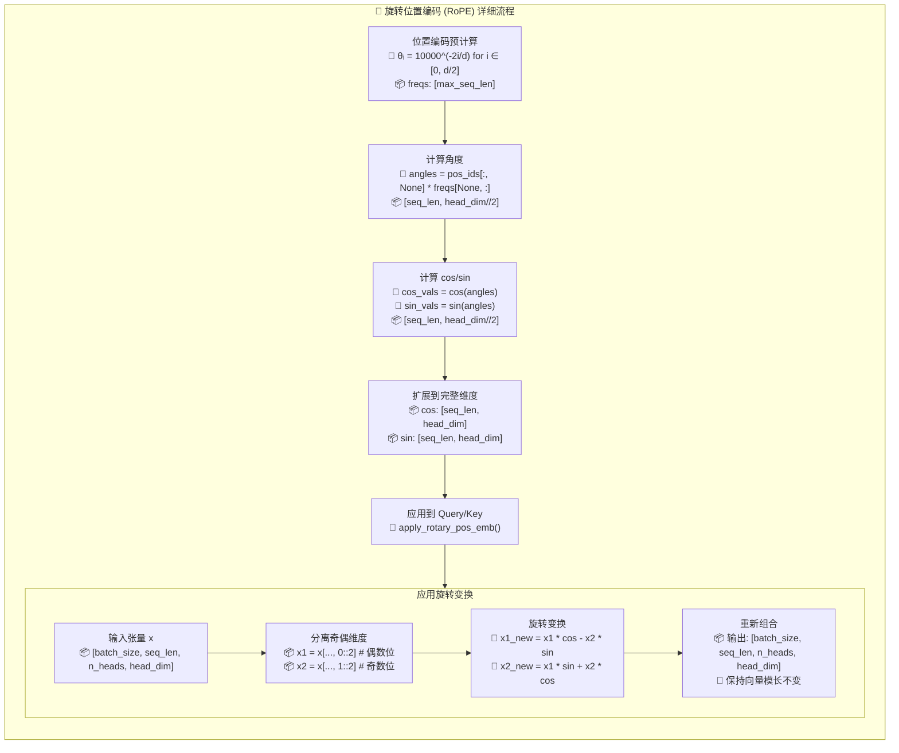
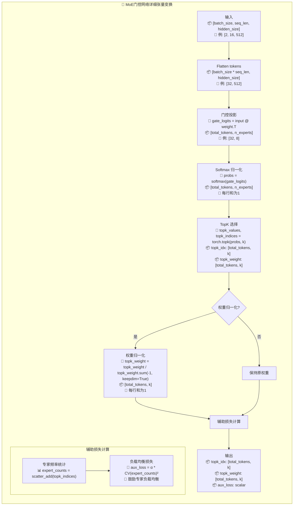
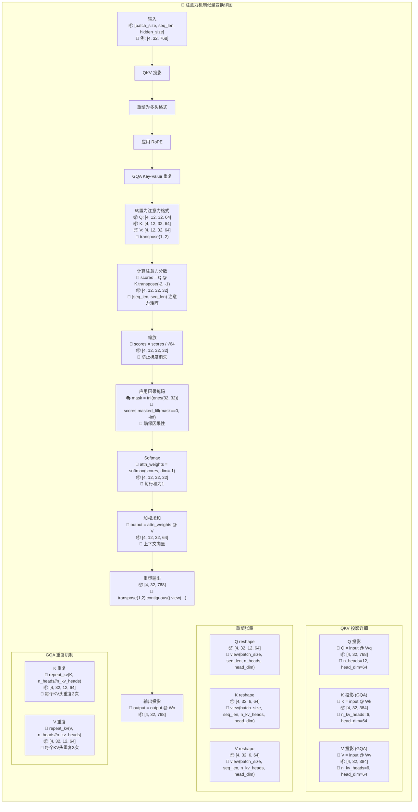
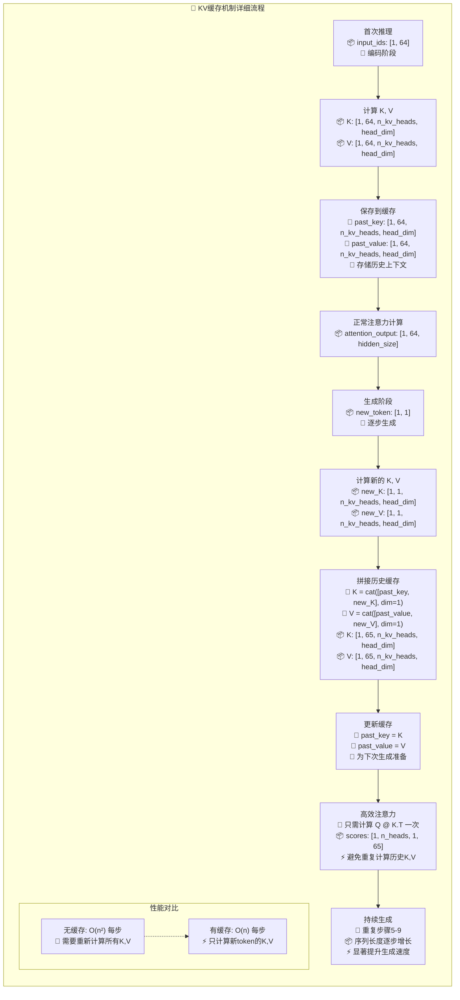
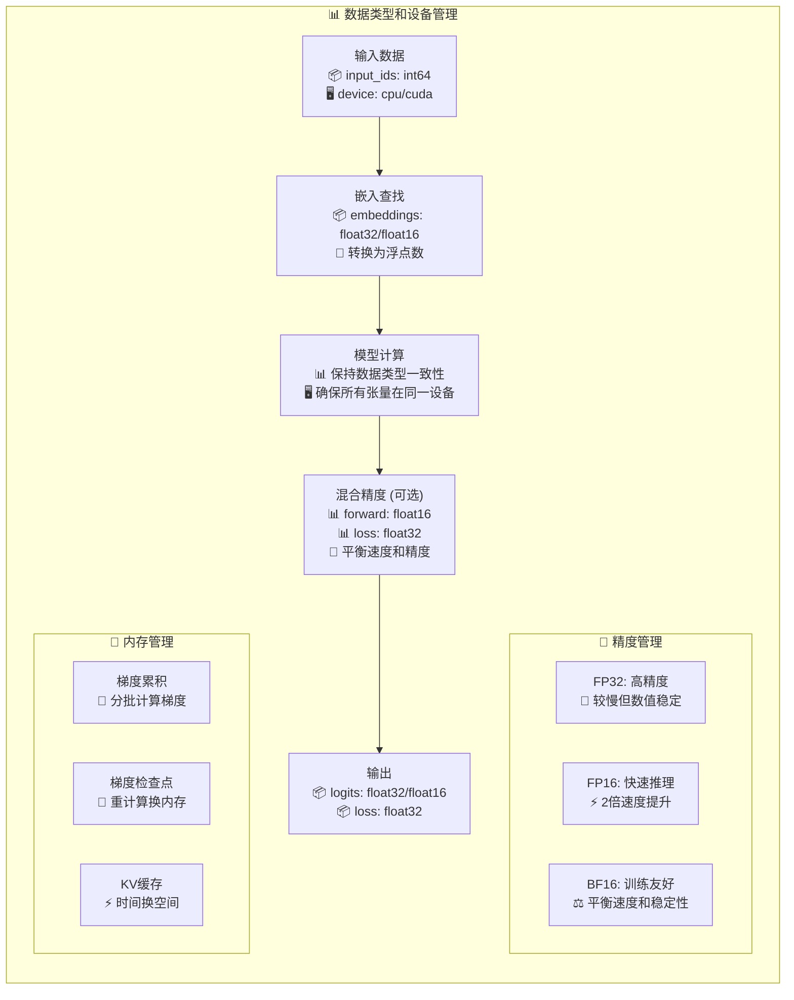

# Zero2LLMV 张量流程图

本文档详细描述了 Zero2LLMV 模型中张量在各个组件间的流动过程，包括形状变换和数学运算。

## 完整模型张量流程图

## RoPE 位置编码详细流程

## MoE 门控网络详细流程

## 注意力机制张量变换详图

## KV 缓存机制流程图

## 数据类型和设备管理

## 关键张量形状总结表

| 组件 | 输入形状 | 输出形状 | 关键参数 |
|------|----------|----------|----------|
| **Embedding** | `[B, L]` | `[B, L, H]` | vocab_size, hidden_size |
| **RMSNorm** | `[B, L, H]` | `[B, L, H]` | hidden_size, eps |
| **RoPE** | `[B, L, Nh, Dh]` | `[B, L, Nh, Dh]` | head_dim, max_seq_len |
| **Attention** | `[B, L, H]` | `[B, L, H]` | n_heads, n_kv_heads |
| **FeedForward** | `[B, L, H]` | `[B, L, H]` | hidden_size, intermediate_size |
| **MoE Gate** | `[B*L, H]` | `[B*L, K], [B*L, K], scalar` | n_experts, topk |
| **Expert FFN** | `[tokens, H]` | `[tokens, H]` | 每个专家独立的FFN |
| **LM Head** | `[B, L, H]` | `[B, L, V]` | hidden_size, vocab_size |

**符号说明:**
- B: batch_size (批次大小)
- L: seq_len (序列长度)  
- H: hidden_size (隐藏层维度)
- Nh: n_heads (注意力头数)
- Nkv: n_kv_heads (KV头数)
- Dh: head_dim (每个头的维度 = H/Nh)
- I: intermediate_size (FFN中间层维度)
- V: vocab_size (词汇表大小)
- K: num_experts_per_token (每token选择的专家数)
- E: n_routed_experts (总专家数)

这个详细的张量流程图展示了Zero2LLMV模型中每个组件的精确张量变换过程，包括形状变化、数学运算和关键的架构特性如MoE、GQA和KV缓存机制。