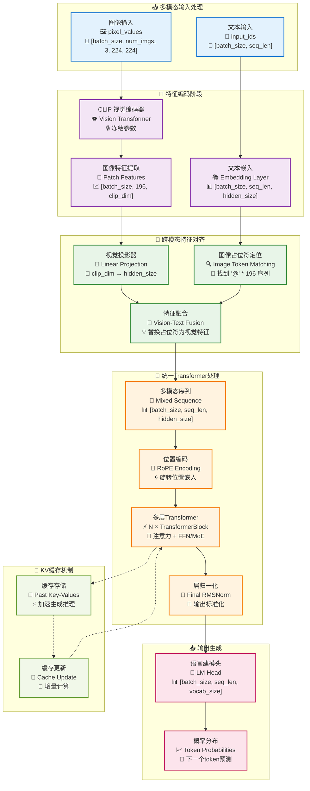
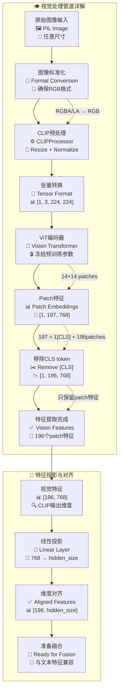
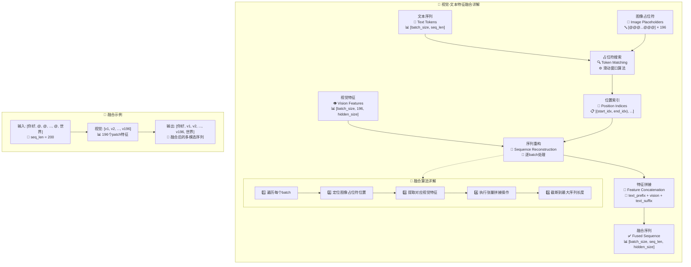
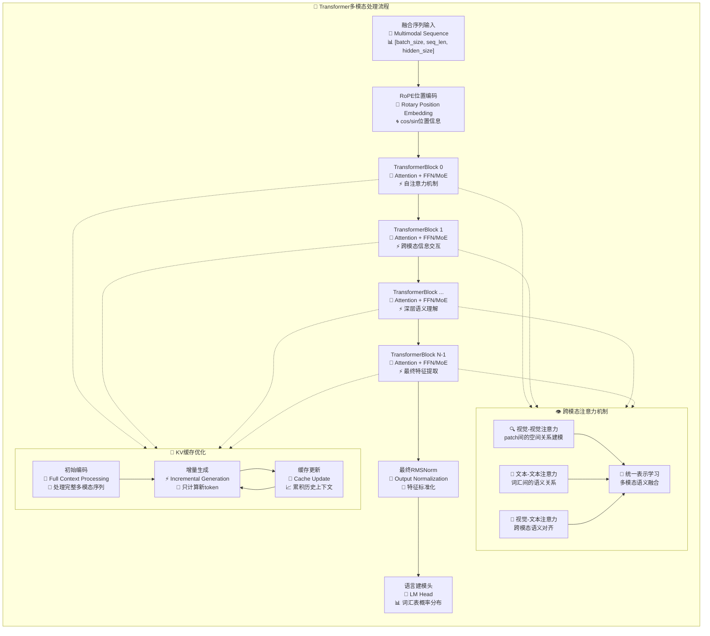
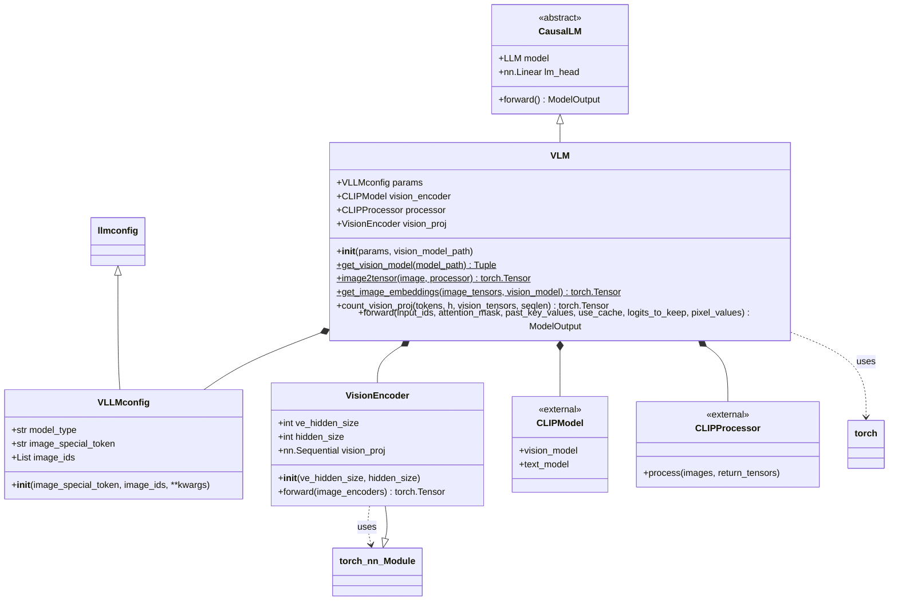
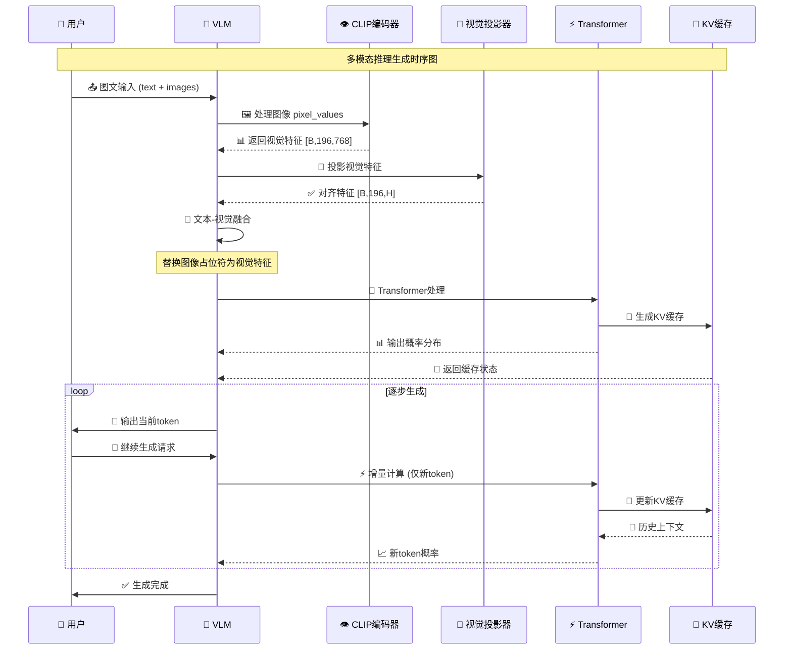
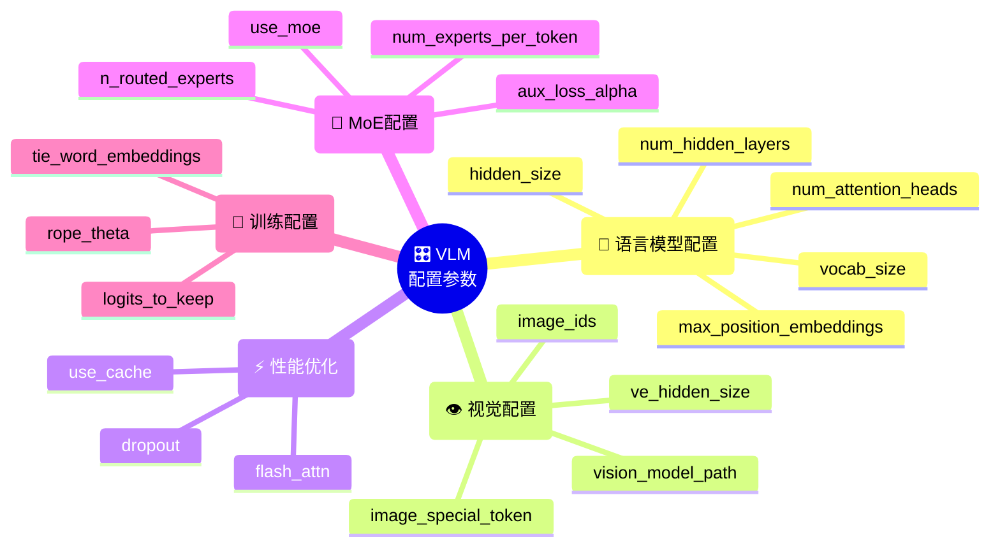
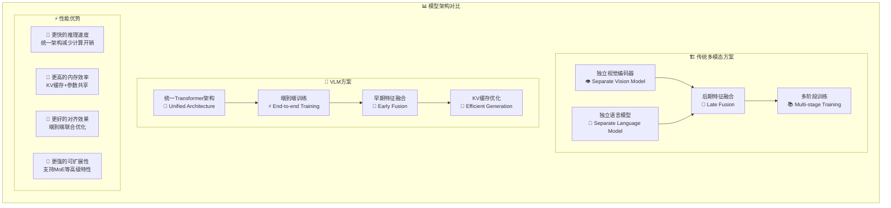

# VLM 视觉语言模型架构文档

## 🎯 模型概览

VLM（Vision Language Model）是基于强大的 CausalLM 大语言模型架构扩展的多模态视觉语言模型，能够同时理解和处理文本与图像信息。

### 核心特性
- 🧠 **统一架构**: 基于 Transformer 的端到端多模态学习
- 🔄 **视觉-语言对齐**: 通过投影层实现视觉与文本特征的语义对齐  
- ⚡ **高效推理**: 支持 KV 缓存加速文本生成
- 🎯 **灵活扩展**: 支持不同规模的视觉编码器和语言模型组合
- 🔧 **MoE 支持**: 继承 CausalLM 的专家混合架构优势

## 🏗️ 整体架构流程图



## 🔍 视觉处理详细流程



## 🔗 多模态特征融合机制



## ⚙️ Transformer处理流程



## 📊 张量维度变换详解

```mermaid
flowchart LR
    subgraph TensorFlow["📐 张量流转换详细追踪"]
        direction TB
        
        %% 输入阶段
        subgraph Input["📥 输入张量"]
            I1["input_ids<br/>📊 [B, L]<br/>🔢 int64"]
            I2["pixel_values<br/>📊 [B, N, 3, 224, 224]<br/>🔢 float32"]
        end
        
        %% 编码阶段
        subgraph Encode["🔄 编码阶段"]
            E1["text_embeds<br/>📊 [B, L, H]<br/>💡 文本嵌入"]
            E2["vision_features<br/>📊 [B, N, 196, C]<br/>👁️ CLIP特征"]
            E3["vision_proj<br/>📊 [B, N, 196, H]<br/>🎯 投影特征"]
        end
        
        %% 融合阶段
        subgraph Fusion["🔗 特征融合"]
            F1["multimodal_seq<br/>📊 [B, L, H]<br/>🔗 融合序列"]
        end
        
        %% Transformer阶段
        subgraph Transform["🧠 Transformer"]
            TR1["hidden_states<br/>📊 [B, L, H]<br/>⚡ 每层输出"]
            TR2["final_hidden<br/>📊 [B, L, H]<br/>🎯 最终隐藏态"]
        end
        
        %% 输出阶段
        subgraph Output["📤 最终输出"]  
            O1["logits<br/>📊 [B, L, V]<br/>📈 词汇概率"]
        end
        
        %% 张量流转换
        I1 --> E1
        I2 --> E2
        E2 --> E3
        E1 --> F1
        E3 --> F1
        F1 --> TR1
        TR1 --> TR2
        TR2 --> O1
        
        %% 维度说明
        subgraph Legend["📏 维度说明"]
            L1["B = batch_size (批次大小)"]
            L2["L = seq_len (序列长度)"]
            L3["H = hidden_size (隐藏维度)"]
            L4["N = num_images (图像数量)"]
            L5["C = clip_hidden_size (CLIP维度)"]
            L6["V = vocab_size (词汇表大小)"]
        end
    end
```

## 🎯 核心组件类图



## 🚀 推理生成流程



## 🎛️ 配置参数说明



## 📈 性能特性对比



## 🔧 使用示例代码

```python
# 模型初始化
from models.vision_encoder import VLM, VLLMconfig

# 配置多模态模型参数
config = VLLMconfig(
    hidden_size=768,
    num_attention_heads=12,
    num_hidden_layers=12,
    vocab_size=50000,
    image_special_token='@' * 196,  # 196个patch对应的占位符
    image_ids=[34] * 196,           # 图像token的ID序列
    use_moe=True,                   # 启用MoE架构
    num_experts_per_token=2,        # 每token选择2个专家
    n_routed_experts=8              # 总共8个专家
)

# 加载模型
model = VLM(
    params=config,
    vision_model_path="./models/clip-vit-base-patch16"
)

# 推理示例
import torch
from PIL import Image

# 准备输入
text = "请描述这张图片："
image = Image.open("example.jpg")

# 文本tokenization (假设已有tokenizer)
input_ids = tokenizer(text + '@' * 196, return_tensors='pt')['input_ids']

# 图像预处理
pixel_values = VLM.image2tensor(image, model.processor).unsqueeze(0)

# 模型推理
with torch.no_grad():
    outputs = model(
        input_ids=input_ids,
        pixel_values=pixel_values,
        use_cache=True  # 启用KV缓存加速生成
    )
    
# 获取预测结果
logits = outputs.logits
predicted_token_id = torch.argmax(logits[0, -1, :]).item()
```

---

## 📝 总结

VLM 通过以下核心设计实现了高效的多模态理解与生成：

1. **🔗 早期特征融合**: 在Transformer处理前就完成视觉-文本特征对齐
2. **🧠 统一架构**: 使用同一套Transformer参数处理多模态信息
3. **⚡ 高效推理**: KV缓存机制显著加速文本生成
4. **🎯 端到端优化**: 整个多模态管道可以联合训练优化
5. **🔧 架构扩展性**: 完全继承CausalLM的高级特性(MoE、GQA等)

这种设计既保持了强大的多模态理解能力，又实现了工程上的高效性和可扩展性。